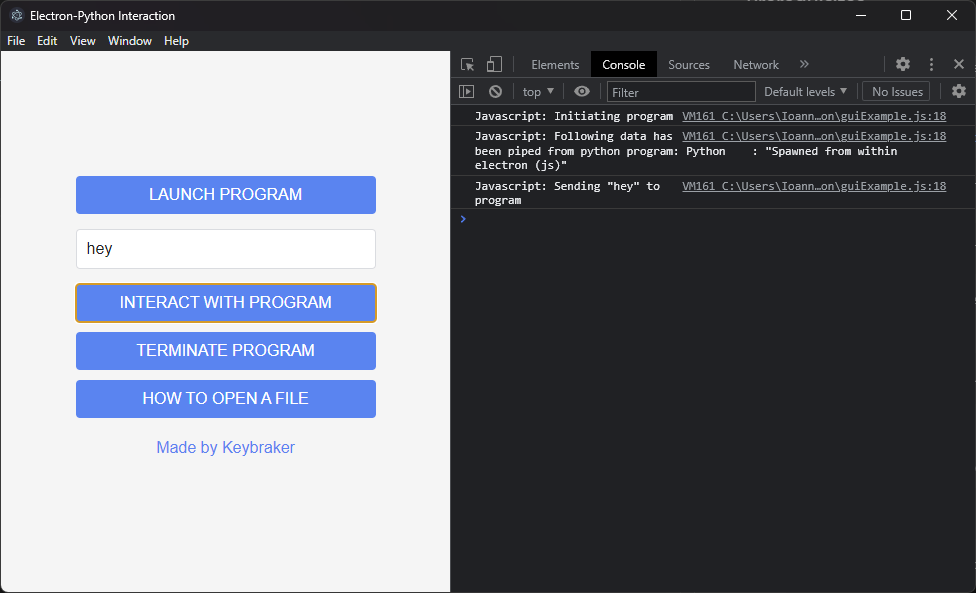

# Electron GUI for Python

A simple example on how to create an electron GUI for a python program and interacting with it.

## How does it work ( simple representation )

```text
electron
--------> |------------|    python
          |            |-------------> |-------------------|
          |  electron  |  sub process  | python program    |
          |  --------  |               | --------------    |
          |   > html   |      std      |  takes requests   |
          |   > css    | <-----------> |  from js and      |
          |   > js     | communication |  responds it,     |
          |            |               |  in the terminal  |
          |------------|               |-------------------|
```

Essentially no network is being created only one terminal is used when electron is launched and than from
within javascript ( electron ) a python program is initiated as a subprocess.
These two programs than communicate via standard streams.

### Structure of example

```text
│
├── docs
│   ├── README.md
│   └── LICENSE
|
├── images
│   └── ...
|
├── guiExample.html
├── guiExample.css
├── guiExample.js
├── main.js
│
├── pythonExample.py
|
├── config.json
└── package.json
```

## Prerequisites

Install Node.js and Python.

> ote that installation may be different for different operating systems

## Installation Guide

1. To download and install [electron](https://electron.atom.io) ( OS X or Linux ) you have to download it from [npm-electron](https://www.npmjs.com/package/electron) using :

   ```
   npm install electron --save-dev
   ```

   ```
   npm install -g electron
   ```

   ( if you don't have npm installed use this [link](https://nodejs.org/en/download/) to download it. )

2. Clone this repository:
   ```
   git clone https://github.com/keybraker/python-gui-electron.git
   ```

## Execution Guide

1. Open a terminal window and cd to cloned project

   ```
   cd python-gui-electron
   ```

2. Initialize the electron application (first-time)

   ```
   npm i
   ```

3. Run the electron application

   ```
   npm start
   ```

4. A page should spawn looking as follows:



1. Press **LAUNCH PROGRAM\_** button

   this will launch a python application with a loop inside,
   that is waiting for data to be send from js

2. Press **INTERACT WITH PROGRAM** button

   this will send a message named "hello" from js to python
   and python will read it and print a message

3. Press **TERMINATE PROGRAM** button

   a termination message ("terminate") is sent to the program which knows
   to stop the loop and execution

4. Press **HOW TO OPEN A FILE** button

   from `electron/guiExample.js` an ipc.send message is sent to the main.js
   which will then read and output `config.json` values (fast feature to store settings).

### Interpretation Guide

Important functionality can be found in files `electron/guiExample.js` where the core of electron is. Listeners are implemented there awaiting for click events to trigger initialization of program, communication and termination. The program `python/pythonExample.py` which is the external or 3rd party application that electron calls, is a simple for-loop awaiting commands. It responds to commands and terminates when sent an empty string, "terminate" or by pressing the terminate program button.

## Authors

- **Ioannis Tsiakkas** - _(Keybraker)_ - [Keybraker](https://github.com/keybraker)

[](https://www.python.org/downloads/)
[](https://www.python.org/download/releases/3.0/)
[](https://electron.atom.io)
[](https://www.apple.com/lae/macos/big-sur/)
[](https://www.apple.com/lae/macos/big-sur/)
[](https://ubuntu.com)
